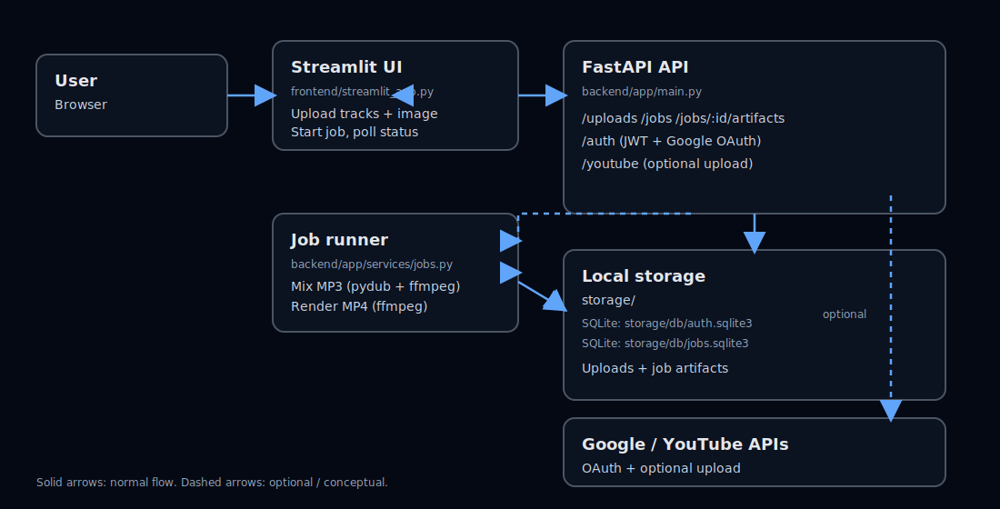

# Mixtape Creation (FastAPI + Streamlit)

This project takes a folder of tracks and turns it into a single **smooth, crossfaded mixtape**.
You upload:
- your audio files (mp3/wav/flac/etc)
- one background image

…and it outputs:
- a mixed **MP3**
- an **MP4** video (the image looped over the audio)
- timestamps + description text

You can also connect a YouTube account and upload the final video (optional).

## Architecture (high-level)




## Data flow (what happens when you click “Start mixing job”)

- **Upload**
  - Streamlit uploads tracks → `POST /uploads/tracks`
  - Streamlit uploads an image → `POST /uploads/image`
- **Create job**
  - Streamlit creates a job → `POST /jobs` (includes `tracks_upload_id`, `bg_image_upload_id`, options)
  - Backend writes job metadata to SQLite and spawns a background thread on the same machine
- **Process**
  - Read metadata (track tags + duration)
  - Build a single mixed MP3 using crossfades
  - (Optional) Render an MP4 by looping the uploaded image over the audio
  - Generate description + timestamps
  - (Optional) Upload the MP4 to YouTube if the user connected YouTube OAuth
- **Download**
  - Streamlit polls `GET /jobs/{job_id}` and shows download buttons that hit `GET /jobs/{job_id}/artifacts/*`

## Tech stack

- **Frontend**: Streamlit
- **Backend**: FastAPI + Uvicorn
- **Auth**: JWT (API calls) + Google OAuth (login) + YouTube OAuth (upload)
- **Storage**: Local filesystem under `storage/` + SQLite (`storage/db/auth.sqlite3`, `storage/db/jobs.sqlite3`)
- **Audio mixing**: `pydub` (high-level audio ops) + **ffmpeg** (actual decoding/encoding)
- **Video rendering**: `ffmpeg` (image loop + AAC audio + H.264 video)
- **Metadata**: `mutagen` (reading tags/durations)

## “Research” / approach behind it

### Crossfade algorithm (why it sounds seamless)
The job runner builds a single timeline by repeatedly:
- picking an overlap window \( \text{overlap} = \min(\text{transition\_ms}, \text{len(song)}, \text{len(mixtape)}) \)
- fading out the outgoing tail and fading in the incoming head
- low-passing the overlap region to smooth harshness during the transition
- overlaying the two overlap segments, then concatenating the remainder

This is implemented in `backend/app/services/mixing.py` and mirrors the experimentation captured in the notebooks.

### Why ffmpeg is required
`pydub` is a Python wrapper for manipulating audio, but it relies on **ffmpeg/ffprobe** to actually decode/encode MP3/WAV/FLAC/etc. Video rendering also calls ffmpeg directly.

### Why a “job” model
Mixing and video rendering can take time, so the API starts a job and returns immediately. The Streamlit UI polls for status and provides download links when artifacts are ready.

## Project layout

- `frontend/streamlit_app.py`: Streamlit UI (upload tracks + upload image + start job + monitor + downloads)
- `backend/app/main.py`: FastAPI app + routers
- `backend/app/api/`: HTTP endpoints (`auth`, `uploads`, `jobs`, `artifacts`, `youtube`)
- `backend/app/services/`: core processing (mixing, video, timestamps, description, youtube)
- `storage/`: local data root (SQLite + uploads + job artifacts)

## Run locally (end-to-end)

### Quickstart (clone + run in a local folder)

```bash
# 1) Clone into a local folder
git clone <paste-your-repo-url>
cd Mixtape_Creation

# 2) Create & activate a virtualenv
python -m venv .venv
source .venv/bin/activate

# 3) Install Python deps
pip install -r requirements.txt

# 4) Install ffmpeg (required for mixing + video)
# macOS (Homebrew):
#   brew install ffmpeg
# Ubuntu/Debian:
#   sudo apt-get update && sudo apt-get install -y ffmpeg

# 5) Configure env vars (minimum)
export API_BASE="http://127.0.0.1:8000"
export JWT_SECRET="change-me-to-a-long-random-string"

# 6) Run backend (Terminal 1)
uvicorn backend.app.main:app --reload --host 127.0.0.1 --port 8000

# 7) Run frontend (Terminal 2)
streamlit run frontend/streamlit_app.py
```

### Prerequisites

- Python 3.11+ (3.12 recommended)
- **ffmpeg** installed and on PATH
  - macOS (Homebrew): `brew install ffmpeg`
  - Ubuntu/Debian: `sudo apt-get install -y ffmpeg`

### Install

```bash
python -m venv .venv
source .venv/bin/activate
pip install -r requirements.txt
```

### Configure environment variables

The UI needs to know where the API is:

```bash
export API_BASE="http://127.0.0.1:8000"
```

The backend uses these (set via shell env vars or a `.env` you load yourself):

```bash
# required for secure JWT signing (change this!)
export JWT_SECRET="change-me-to-a-long-random-string"

# required if you use YouTube OAuth (encrypts stored OAuth tokens)
export TOKENS_ENCRYPTION_KEY="(optional unless using YouTube) - see below"

# Storage location
# - This project stores DB + uploads + artifacts under `./storage/` by default.
# - If you want a different location, edit `backend/app/core/config.py` (`_default_storage_root()`).
```

#### Generating `JWT_SECRET`

You generate this locally (it’s just a long random string). For example:

```bash
# Option 1 (Python)
python -c "import secrets; print(secrets.token_urlsafe(64))"

# Option 2 (OpenSSL)
openssl rand -hex 32
```

#### Generating `TOKENS_ENCRYPTION_KEY` (only if using YouTube OAuth)

```bash
python -c "from cryptography.fernet import Fernet; print(Fernet.generate_key().decode())"
```

### Start backend

```bash
uvicorn backend.app.main:app --reload --host 127.0.0.1 --port 8000
```

### Start frontend

```bash
streamlit run frontend/streamlit_app.py
```

## OAuth setup (optional)

### Google login (Streamlit “Continue with Google”)

- Provide a valid Google OAuth client secrets file at `client_secrets.json`
- Backend redirect URL is configured by:
  - `GOOGLE_OAUTH_REDIRECT_URI` (default: `http://localhost:8000/auth/google/callback`)
  - `STREAMLIT_REDIRECT_BASE` (default: `http://localhost:8501`)

### YouTube upload (optional)

- Provide `client_secrets.json`
- Set:
  - `YOUTUBE_OAUTH_REDIRECT_URI` (default: `http://localhost:8000/youtube/oauth/callback`)
  - `TOKENS_ENCRYPTION_KEY` (required to store tokens safely)

## Testing

```bash
python -m pytest -q
```

## Troubleshooting

- **“ffmpeg not found” / audio/video fails**
  - Ensure `ffmpeg` is installed and available on your PATH: `ffmpeg -version`
- **Login/OAuth redirects fail**
  - Verify redirect URIs match what you configured in Google Cloud Console
  - Check `GOOGLE_OAUTH_REDIRECT_URI`, `YOUTUBE_OAUTH_REDIRECT_URI`, `STREAMLIT_REDIRECT_BASE`

